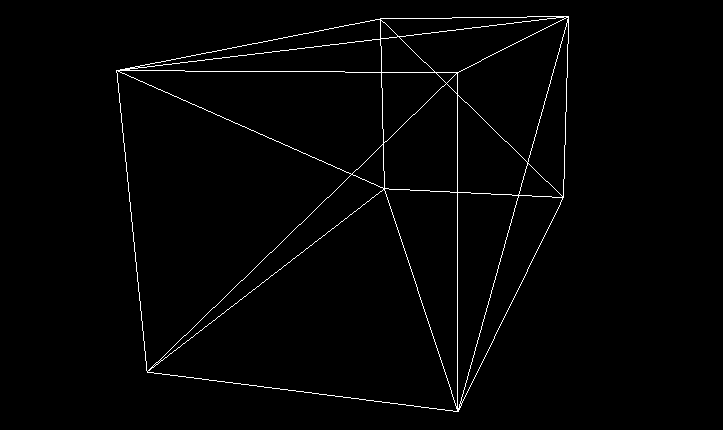
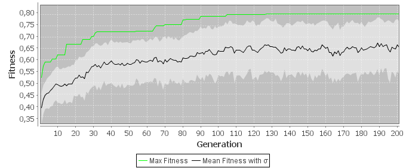

# Evolutionary Container Loading

Student project for solving the container loading problem using evolutionary algorithms.

Built using 
[Scala](http://www.scala-lang.org/),
[Watchmaker](http://watchmaker.uncommons.org/),
[Java 3D](https://java3d.java.net/), and
[JFreeChart](http://www.jfree.org/jfreechart/).

For a detailed description of the methods and background have a look at the [project report](project_report/report.pdf) (German).

Visualization of the best candidate found. Note that a realistic loading order of the container is not taken into account.

A plot showing the evolution of the solution.